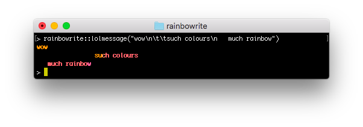

# rainbowrite

<!-- badges: start -->
[](https://www.repostatus.org/#wip)
[](https://github.com/richfitz/rainbowrite/actions)
[](https://codecov.io/github/richfitz/rainbowrite?branch=master)
[](https://www.codefactor.io/repository/github/richfitz/rainbowrite)

<!-- badges: end -->

This package contains a drop-in replacement for R's `cat`, `message` and `print`, inspired by [lolcat](https://github.com/busyloop/lolcat).

## Usage

Use it just like `cat`


```r
for (i in 1:10) {
  rainbowrite::lolcat("hello world\n")
}
```


Or like `message`


```r
rainbowrite::lolmessage("wow\n\t\tsuch colours\n   much rainbow")
```




Modify functions that already use `cat` or `message` using `lolify`:


```r
lolsay <- rainbowrite::lolify(cowsay::say)
lolsay("I ate a rainbow", "longcat")
```


# Installation

Install from github using [remotes](https://github.com/r-lib/remotes):

```r
remotes::install_github("richfitz/rainbowrite", upgrade = FALSE)
```

## License

MIT + file LICENSE © [Rich FitzJohn](https://github.com/richfitz)
